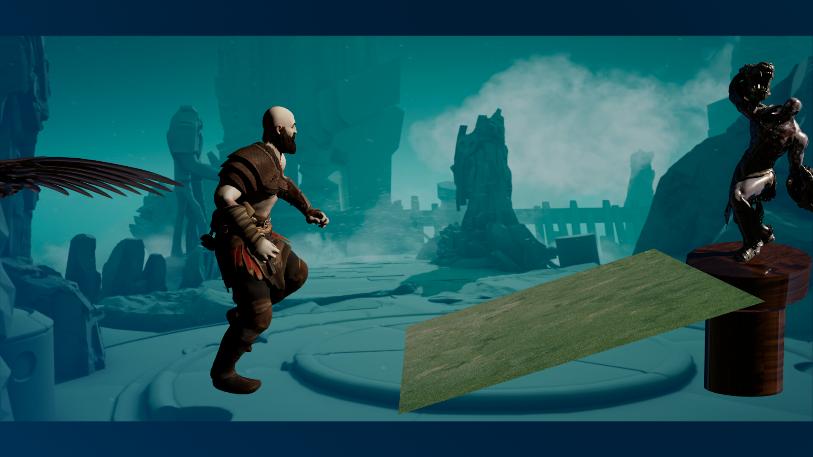
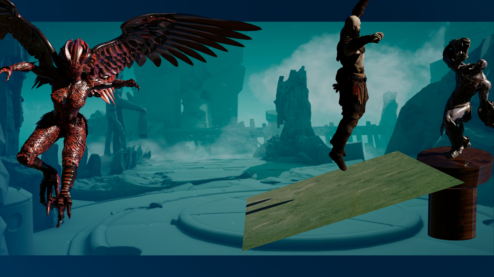

# Echoes of Youth: Animating a Game Scene in Maya

**Graphics and Visual Computing (GVC) Project**

An animated game scene created in Autodesk Maya, inspired by the visual language of God of War. An older character hallucinates a younger version of himself, conjured by a creature, inside a mysterious realm.

**Student:** Priyanshu Dhingra | **Roll No.:** 21IT3022 | **Branch:** IT

## Project Overview

This project covers the complete 3D animation workflow in Maya:

- Importing and preparing 3D character models
- Texturing and material creation
- Rigging characters for animation
- Character animation using Mixamo and the Trax Editor
- Python-scripted creature animation, refined in the Graph Editor
- Scene composition, camera setup and Arnold lighting with HDRI
- Final frame-by-frame render and video editing

## Showcase Video

<!--
HOW TO ADD THE VIDEO:
1. Click the pencil icon (Edit) on this README on github.com.
2. Drag and drop your .mp4 file here, on its own line.
3. GitHub will insert a link that plays the video inline. Commit the change.
-->

## Project Gallery

<p align="center">
  
  
</p>

## Workflow

| Step | Description |
|------|-------------|
| 1. Import models | Imported downloaded 3D character models into Maya (File → Import) |
| 2. Texturing | Assigned Blinn/Lambert materials and applied texture files |
| 3. Rigging | Combined meshes, then created a skeleton using Quick Rig |
| 4. Animation | Used Mixamo animations combined in the Trax Editor; animated the creature with a Python script and the Graph Editor |
| 5. Scene setup | Created a render camera, added a ramp and pillar for the statue, and an image plane background |
| 6. Lighting | Arnold Skydome Light with an HDRI from Poly Haven |
| 7. Rendering | Rendered the sequence frame by frame with Arnold |

The final frames were compiled into a video using Adobe Premiere Pro.

## Concepts Covered: Rendering Pipeline

The presentation also explains the stages of the rendering pipeline:

1. Local space
2. World space
3. Camera (view) space
4. Backface culling
5. Projection (perspective and orthographic)
6. Clipping space
7. Perspective divide
8. Image space (Normalized Device Coordinates)
9. Screen space

## Included Assets

- `21IT3022(Priyanshu Dhingra)_GVC_Project.mb`: main Maya scene file
- `21IT3022(Priyanshu Dhingra)_GVC_Project_Video.mp4`: final project showcase video
- `Objects/`: exported FBX model assets
- `Kratos_Textures/`: character texture set
- `Statue and Vulture Textures/`: environment and prop texture assets
- `Project_Video/`: final video output
- `Project_Video_Images/`: rendered frames used in the gallery
- `sourceimages/`: source images and material references
- `scenes/`: Maya scene files and incremental saves
- `workspace.mel`: Maya project workspace configuration

## Repository Structure

```text
.
├── 21IT3022(Priyanshu Dhingra)_GVC_Project.mb
├── 21IT3022(Priyanshu Dhingra)_GVC_Project_Video.mp4
├── Objects/
├── Kratos_Textures/
├── Statue and Vulture Textures/
├── Project_Video/
├── Project_Video_Images/
│   ├── frame1.png
│   └── frame2.png
├── scenes/
├── sourceimages/
├── workspace.mel
├── .gitignore
├── .gitattributes
└── README.md
```

## Tools Used

- Autodesk Maya 2023
- Arnold Renderer
- Mixamo (character animations)
- Poly Haven (HDRI lighting)
- Adobe Premiere Pro (video editing)

## How to Open the Project

1. Open Autodesk Maya 2023.
2. Load the main scene: `21IT3022(Priyanshu Dhingra)_GVC_Project.mb`.
3. Set the project to this folder using `workspace.mel` if needed.
4. Reconnect texture paths if the project is opened on another machine.

## Notes

This project is intended for academic and portfolio presentation. It includes the project structure, final render media and source elements needed for review and demonstration.

## License

This project is shared for educational, academic, and portfolio purposes.
